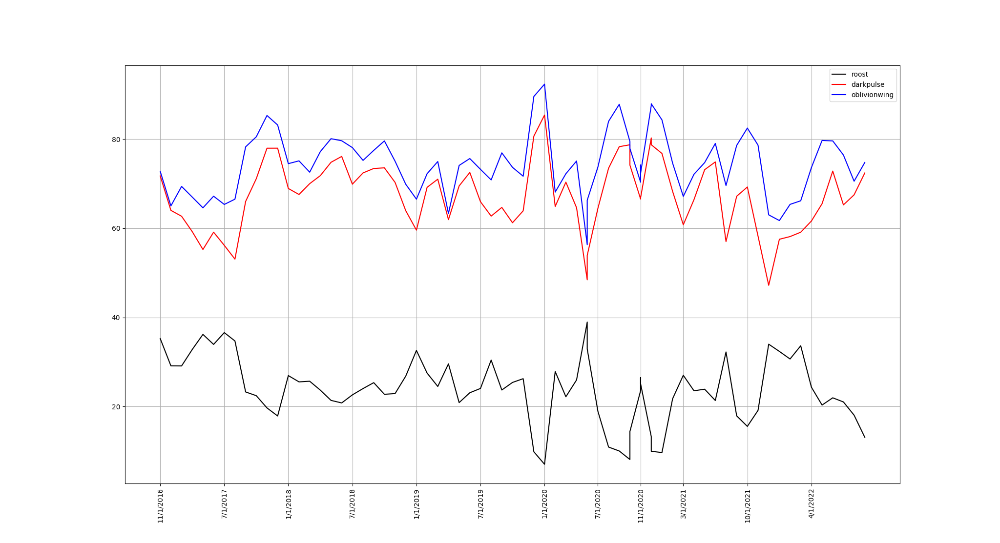

# Smogon stats analyzer

The goal of this project is to analyze Smogon stats and find interesting trends. So far it's focused on finding how a given moveset evolves over time

Toy pro

## Steps

- Get the urls for the formats you want to analyze from smogon using `get_urls.py`
- Download the urls using `stats/download.sh`
- Convert the downloaded JSONs with `stats/sorter.js`. You can do this in parallel with:

```bash
node top.js 16 | xargs -n1 -P 8 node sorter.js >> out.txt
```

You can now plot the data using `stats/plot.py`


